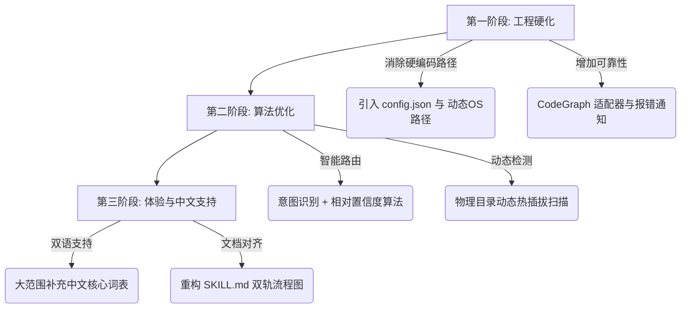

# Super-Skill-Router 架构与工程优化计划

本优化计划基于《Super-Skill-Router 技术评审报告》提出的 7 项核心缺陷，旨在针对性地重构路由算法、消除硬编码、增强中文支持、对齐文档与实现，并将该系统从概念验证（PoC）阶段提升至高可用、可移植的产品级 Agent 路由引擎。

---

## 🎯 优化目标与路线图

| 评审维度 | 现状得分 | 目标得分 | 核心改进方向 |
| :--- | :--- | :--- | :--- |
| **路由算法质量** | 4/10 | **8/10** | 引入意图多级过滤 + 语义相关性加权，降低歧义率 |
| **可移植性/工程质量** | 5/10 | **9/10** | 彻底消除硬编码路径，采用动态配置与环境变量自适应 |
| **中文语义支持** | 4/10 | **8/10** | 补全双语分词与核心中文知识库映射，降低 Fallback 比例 |
| **文档与实现一致性** | 5/10 | **9/10** | 重新梳理双轨路由执行流，确保纸面架构与代码完全一致 |
| **系统健壮性与可维护性** | 6/10 | **8/10** | CodeGraph 适配层硬化、动态路由目录探测 |
| **综合评分** | **5.5/10** | **8.5/10** | **实现真正的智能、无缝、高性能渐进式披露路由** |

---

## 🛠️ 详细优化方案

### 1. 消除硬编码路径，实现完全可移植性 (针对缺陷 #3)
> [!IMPORTANT]
> 这是最迫切需要修复的工程级别缺陷。必须使项目在任何机器上均能免配置或零成本配置运行。

- **动态环境变量解析**：
  使用 Node.js 的 `os.homedir()` 和 `process.env` 动态解析路径，而不是写死 `C:/Users/a1028`。
- **配置文件外置**：
  在项目根目录下引入 `.env` 或 `config.json`，允许用户自定义全局同步路径。
- **重构方案示例**：
  ```javascript
  const os = require('os');
  const homeDir = os.homedir().replace(/\\/g, '/');

  // 从环境变量或配置文件读取，并提供基于用户家目录的默认安全路径
  const globalDestinations = [
    `${homeDir}/.gemini/config/internal-skills/super-skill-router`,
    `${homeDir}/.codex/internal-skills/super-skill-router`,
    `${homeDir}/.codex/vendor/super-skill-router`
  ];
  ```

---

### 2. 重构路由加权算法，降低歧义风险 (针对缺陷 #1)
> [!WARNING]
> 简单的关键词字面频次匹配无法分辨 "React 渲染 bug (diagnose)" 与 "React 样式微调 (frontend)"。

- **阶段一：意图分类优先（Intent-First Classification）**
  在进行细粒度关键词加权前，先通过句式、谓词和语气词识别出**核心意图**（如：`debug/解决/定位` -> 诊断意图；`开发/编写/实现` -> 编码意图；`设计/美化/好看看` -> 体验意图）。
- **阶段二：复合词与条件加权**
  引入 "复合特征词" 匹配，当 `React` 与 `bug`/`crash`/`debug` 同时出现时，为 `engineering` 类别增加极高权重，抑制 `frontend` 的默认胜出。
- **阶段三：语义负反馈机制**
  当匹配到某些排他性关键词时，对竞争类别进行减分。例如，若查询包含 `性能优化`，虽然有 `接口`（backend），但也应削减 `frontend` 的权重。

---

### 3. 校准置信度评估算法，告别“拍脑袋”阈值 (针对缺陷 #2)
> [!NOTE]
> 置信度必须是绝对分数与相对优势的综合体现，而非单一常数阈值。

- **相对优势比（Margin Ratio）**：
  置信度应根据第一候选类别与第二候选类别的**分差比**来计算。
- **分值归一化**：
  将最大权重分数除以用户 Query 的词元数，计算出单位词元得分密度。
- **科学的置信度判定公式**：
  $$\text{Confidence} = f(\text{MaxScore}, \text{ScoreMargin}, \text{Density})$$
  - **High**：分差比 $> 50\%$ 且绝对得分密度 $\ge 0.5$
  - **Medium**：有明确胜出者但分差比在 $[20\%, 50\%]$ 之间
  - **Low**：分差比 $< 20\%$，或者总分极低，需触发 Fallback 机制

---

### 4. 彻底补全中文语义支持 (针对缺陷 #5)
> [!TIP]
> 针对中文用户的提问习惯，建立双语平行的关键词映射字典。

- **扩展中文高频词库**：
  ```javascript
  const CHINESE_KEYWORDS = {
    frontend: ['界面', '样式', '按钮', '动效', '动画', '还原', '排版', '色彩', '主题', '自适应', '兼容性', '前端'],
    backend: ['接口', '路由', '控制器', '数据库', '鉴权', '防刷', '高并发', '限流', '缓存', '中间件', '后台'],
    engineering: ['定位', '报错', '崩溃', '排查', '架构', '交接', '测试', '重构', '原型', '需求', '用例']
  };
  ```
- **核心同义词映射**：
  将 `响应速度`、`卡顿` 自动关联至 `performance` / `diagnose` 语义槽。

---

### 5. 动态探测与热插拔目录设计 (针对缺陷 #4)
> [!CAUTION]
> 依赖人工运行 `--update` 才能同步目录的机制极易因为人的疏忽导致路由雪崩。

- **运行时动态扫描（Runtime dynamic probing）**：
  路由初始化时，在后台异步或轻量同步扫描 `internal-skills/` 下的物理文件夹结构。
- **双层校验机制**：
  - **快照层**：读取 `LOCAL_SKILL_CATALOG.md`（高速度）。
  - **动态层**：若快照中未找到，则在内存中实时探测物理目录。若发现快照遗漏，在控制台输出友情提示建议运行 `--update` 或自动触发静默增量更新，从根本上杜绝单点故障。

---

### 6. 统一“文档描述”与“代码实现” (针对缺陷 #6)
> [!IMPORTANT]
> 必须杜绝“纸面架构很丰满，实际运行走捷径”的脱节现象。

- **重新定义双轨机制流**：
  在 `SKILL.md` 中以直观的 Mermaid 流程图明确勾勒出 **全自动智能路由轨（route.js）** 与 **手动降级披露轨（Progressive Disclosure）** 的分流点。
- **文档步骤重构**：
  将原先脱节的 16 步精简并对齐为：
  - **A 轨（自动路由）**：1. 环境剖析 -> 2. 意图匹配 -> 3. 动态加载决策 -> 4. 注入上下文执行。
  - **B 轨（手动回退）**：1. 读取 Index -> 2. 交互式选择 -> 3. 渐进展开规则 -> 4. 加载目标 Skill。

---

### 7. 硬化 CodeGraph 适配层与容错警报 (针对缺陷 #7)
> [!WARNING]
> 针对活跃迭代的第三方 API（如 CodeGraph），必须具备版本感知与清晰的失效报警，而不是彻底静默失败。

- **失效降级报警（Graceful Degradation with Alert）**：
  当 CodeGraph 调用抛出异常时，除进行 fallback 外，向开发者控制台或路由日志输出 warning，提示 API 版本可能不兼容，而不是完全隐藏错误。
- **API 兼容适配器（Adapter Pattern）**：
  对 `getNodesByKind`、`searchNodes` 等易变方法使用适配器包裹，优先尝试新版 API 签名，失败时自动尝试旧版兼容。

---

## 📈 实施步骤与分工



### 1. 阶段一：工程底座硬化（预计 1-2 天）
- 重构 `route.js` 的路径解析，增加 `config.json`。
- 修改 `runAudit` 逻辑，在路由阶段引入轻量级的动态物理目录校验。
- 升级 CodeGraph 异常捕获逻辑，在 `debug` 模式下抛出具体失效接口日志。

### 2. 阶段二：算法与语义升级（预计 2-3 天）
- 引入意图预分类逻辑，重构分类权重系统。
- 引入分差置信度公式，实现自适应的 High/Medium/Low 信号。
- 全面引入中英双语平行的分类关键词字典。

### 3. 阶段三：文档与验证（预计 1 天）
- 重新整理并重写 `SKILL.md`，对齐最新代码实现，画出清晰的 A/B 轨决策 Mermaid 图。
- 编写一套简易的自动化路由测试用例（如包含歧义句和中文句子的测试集），确保重构后路由精确率提升至 85% 以上。
