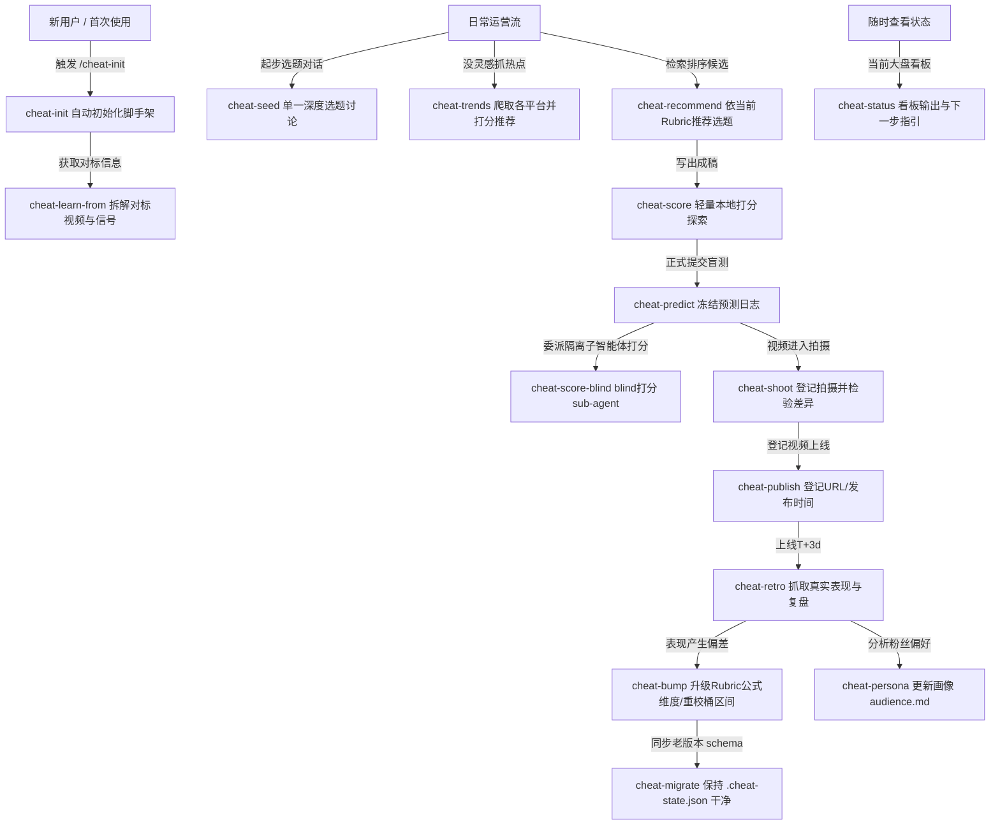

# Skill Rankings & Selection Guide (智能体视角 Skill 排行榜与选择指南)

本指南从 AI Agent 的视角，对各个分类下的 Skill 进行梯队排行与深度解析。对于包含多个子 Skill 的复合系统（如 `cheat-on-content` 和 `hyperframes`），本表在顶层进行统一排行，并阐明其内部协作关系。

未来 Agent 复用此路由时，应以此排行榜作为决策参考，并根据任务的实际上下文（代码基础、开发动作、工程边界等）进行动态且渐进式的选择。

---

## 目录
1. [Frontend (前端与视频动画)](#frontend-前端与视频动画)
2. [Backend (后端开发)](#backend-后端开发)
3. [Deployment (运维部署)](#deployment-运维部署)
4. [Document (文档与写作)](#document-文档与写作)
5. [AI Agent (智能体与工具)](#ai-agent-智能体与工具)
6. [Engineering (软件工程与规划)](#engineering-软件工程与规划)
7. [Paper (学术研究)](#paper-学术研究)
8. [Cheat-on-Content (内容创作者量化校准 - 复合系统)](#cheat-on-content-内容创作者量化校准---复合系统)
9. [Specialized / Others (特定业务与个性化)](#specialized--others-特定业务与个性化)

---

## Frontend (前端与视频动画)

此分类处理一切浏览器端页面、组件、样式、交互及视频/动效生成。

| 排名 | Skill 名称 | 角色 / 梯队 | 适用场景与 Agent 选择建议 |
| :---: | :--- | :--- | :--- |
| **1** | [web-frontend](../internal-skills/frontend/web-frontend/INSTRUCTION.md) | **主/辅助** (T0 基础) | 核心网页构建、React/Vue组件、布局排版、CSS样式优化。凡涉及界面UI且非纯视频渲染，首选此项。 |
| **2** | [hyperframes](../internal-skills/frontend/hyperframes/INSTRUCTION.md) | **主** (T1 复合) | HTML-to-Video 渲染与创作流的总入口。Agent 需根据具体诉求渐进式加载其子模块（见下文“HyperFrames 复合子模块”）。 |
| **3** | [taste-skill](../internal-skills/frontend/taste-skill/INSTRUCTION.md) | **辅助** (T1 审美) | 前端设计高标准审查，消除 AI 痕迹，确保极佳的视觉表现、渐变和微交互。 |
| **4** | [impeccable](../internal-skills/frontend/impeccable/INSTRUCTION.md) | **辅助** (T1 规范) | 页面样式精修、可访问性（a11y）、HTML/CSS 规范净化。 |
| **5** | [chrome-devtools-mcp](../internal-skills/engineering/planning/pm-skills/wwas/INSTRUCTION.md) | **主/辅助** (T2 自动化) | Chrome 浏览器自动化操纵、网页截图、JS 报错调试、DOM 分析和运行期性能分析。 |
| **6** | [mimo-jianying-video-workflow](../internal-skills/frontend/mimo-jianying-video-workflow/INSTRUCTION.md) | **主** (T2 视频工作流) | 结合 MiMo 视频理解与剪映 (JianYing) API 的中视频/产品演示视频自动剪辑与优化。 |
| **7** | [jianying-editor-skill](../internal-skills/frontend/jianying-editor-skill/INSTRUCTION.md) | **辅助** (T2 剪辑接口) | 剪映 AI 自动化剪辑的底层封装 API (JyWrapper) 调用。 |
| **8** | [anime](../internal-skills/frontend/anime/INSTRUCTION.md) | **辅助** (T3 动效) | Anime.js 微动画引擎的使用。在做极其轻量的网页交互微动效时选用。 |

### 场景驱动精细化选型示例 (Scenario-Driven Selection Examples)

当面临同属前端但在技术栈/动效实现上存在细微分化的任务时，Agent 应根据具体库/技术要求组合最优 Skill：

*   **场景一：纯前端 UI 交互与 GSAP 页面微动效 (GSAP UI & Page Interaction)**
    *   *特征*：需要在 Web/React/Vue 页面中实现卡片翻转、滚动视差、缓动过渡。
    *   *最优组合*：`web-frontend` (主，UI 与核心布局) + `taste-skill` (辅助，消除 AI 味，把关渐变与微交互质感) + `hyperframes-animation` (辅助，提取 GSAP 曲线公式与原子缓动配置)。
*   **场景二：三维与物理模拟动画 (3D & Physics Simulation Animation)**
    *   *特征*：需要 Canvas 粒子系统、重力/碰撞物理引擎、WebGL 三维场景。
    *   *最优组合*：`web-frontend` (主) + `hyperframes-animation` (辅助，读取其 `Three.js/TypeGPU` 运行时适配器规范与渲染控制) 或调用底层三维物理库规范。
    *   *决策*：跳过偏向平面视觉排版的 `taste-skill`，优先加载注重帧率监控、着色器配置与刚体动力学的规则。
*   **场景三：人声视频配酷炫特效字幕 (Cinematic Captions)**
    *   *特征*：为已录制好的人声视频添加具有遮罩遮挡、霓虹发光、逐字译码的视频字幕。
    *   *最优组合*：`hyperframes` (主) + `embedded-captions` (专门子 Skill，读取 caption column-flow 与 layout 契约)。

### HyperFrames 复合子模块说明
`hyperframes` 是一个庞大的渲染系统。当识别到视频生成需求时，Agent 应先加载 `hyperframes-read-first`，再根据以下细分场景选择最精准的子 Skill：
- **核心逻辑与基础**：`hyperframes-core`（DOM契约验证）、`hyperframes-animation`（原子运动与曲线）、`hyperframes-creative`（视觉规范设计）。
- **工具链控制**：`hyperframes-cli`（命令行渲染/AWS Lambda部署）、`hyperframes-registry`（模块和组件合并）、`hyperframes-media`（TTS/BGM等素材预处理）。
- **特定视频模板生成**：
  - `faceless-explainer`：纯文本直接生成解说视频。
  - `pr-to-video`：GitHub PR 代码变更（Code Diff）生成视频。
  - `product-launch-video`：针对 SaaS 产品官网的发布介绍视频。
  - `website-to-video`：网站/个人主页展示与巡回视频。
  - `graphic-overlays`：为已有的人声视频（播客等）叠加动态卡片和图画。
  - `embedded-captions`：为视频嵌入特效字幕。
  - `motion-graphics`：短视频动效制作。
  - `remotion-to-hyperframes`：将已有的 React Remotion 视频移植到 HyperFrames。

---

## Backend (后端开发)

| 排名 | Skill 名称 | 角色 / 梯队 | 适用场景与 Agent 选择建议 |
| :---: | :--- | :--- | :--- |
| **1** | [api-backend](../internal-skills/backend/api-backend/INSTRUCTION.md) | **主** (T0 基础) | 后端接口契约设计、API 修改、鉴权（Token/JWT）、数据库 CRUD 优化、安全防护加固（防注入、限流）。后端问题仅需此核心 Skill 配合通用工程 Skill 即可。 |

---

## Deployment (运维部署)

| 排名 | Skill 名称 | 角色 / 梯队 | 适用场景与 Agent 选择建议 |
| :---: | :--- | :--- | :--- |
| **1** | [nginx](../internal-skills/deployment/nginx/INSTRUCTION.md) | **主** (T0 基础) | Nginx 服务配置、反向代理转发、SSL 证书配置、防盗链、负载均衡配置。 |

---

## Document (文档与写作)

| 排名 | Skill 名称 | 角色 / 梯队 | 适用场景与 Agent 选择建议 |
| :---: | :--- | :--- | :--- |
| **1** | [document-skills](../internal-skills/document/document-skills/INSTRUCTION.md) | **主** (T0 专业格式) | 专门处理 Office 文件（DOCX, PDF, PPTX, XLSX）的分析、编辑与保真生成。 |
| **2** | [writing](../internal-skills/document/writing/INSTRUCTION.md) | **主/辅助** (T1 文本) | 技术博客、README、操作手册、公文文案的写作与润色修饰。 |

---

## AI Agent (智能体与工具)

| 排名 | Skill 名称 | 角色 / 梯队 | 适用场景与 Agent 选择建议 |
| :---: | :--- | :--- | :--- |
| **1** | [codegraph](../internal-skills/ai-agent/code-indexing/INSTRUCTION.md) | **主/辅助** (T0 理解) | 项目静态依赖分析、调用链追踪、影响范围评估。能显著提升大项目认知深度，在软件工程和编码任务中具有最高优先级。 |
| **2** | [headroom](../internal-skills/ai-agent/headroom/INSTRUCTION.md) | **辅助** (T1 压缩) | 对超长控制台输出、长日志堆栈、超长会话历史或大量 RAG 数据块进行文本级和语法级 Token 压缩（节约 60-95% Token）。在遇到大文件处理和日志审查时具有最高优先级。 |
| **3** | [claude-mem](../internal-skills/engineering/planning/pm-skills/wwas/INSTRUCTION.md) | **主/辅助** (T1 记忆) | 长文本上下文压缩、跨会话关键记忆读取与持久化更新。 |
| **4** | [super-skill-router](../internal-skills/engineering/planning/pm-skills/wwas/INSTRUCTION.md) | **主** (T1 入口) | 技能路由管理。仅在需要诊断路由偏差、更新/健康检查技能库、或者安装新技能时激活其本尊。 |
| **5** | [skill-design](../internal-skills/ai-agent/skill-design/INSTRUCTION.md) | **主** (T2 构建) | 设计与构建新的 Codex Skill 声明 and 文档规范。 |
| **6** | [unlimited-ocr]([unlimited-ocr](internal-skills/unlimited-ocr/INSTRUCTION.md)) | **主/辅助** (T2 工具) | 本地离线高精度多模态 OCR 提取，专门用于识别 LaTeX 公式、复杂论文版面与大表格。 |
| **7** | [awesome-skills](../router/LOCAL_SKILL_CATALOG.md) | **辅助** (T3 库引用) | 全局 1500+ 个外部专门 Skill 模板库。需要扩展能力时作为搜索蓝图。 |
| **8** | [find-skills](../internal-skills/engineering/planning/pm-skills/wwas/INSTRUCTION.md) | **辅助** (T3 检索) | 快速根据用户口头诉求查找本机或网络中对应的 Skill。 |

### CodeGraph 与 Headroom 优先选用指南 (CodeGraph vs Headroom Selection Guide)
- **原理差异**：CodeGraph 侧重于**“精准只读”**（通过静态语法树定位函数与类，阻止不相关文件进入上下文）；Headroom 侧重于**“后置压缩”**（通过 AST 剪枝、JSON 压缩等算法裁剪已生成的超大上下文）。
- **选用原则**：
  - 在**代码重构、测试查找、Bug定位、API/接口分析**等需要高保真代码结构的场景，**必须优先选用 CodeGraph**。Headroom 的压缩可能导致编译细节丢失。
  - 在**调试堆栈分析、长日志排查、长对话持久化、大规模外部文本阅读**等充满冗余文本的场景，**优先选用 Headroom** 进行 Token 瘦身。

---

## Engineering (软件工程与规划)

此分类定义了最严谨的工程实践方法论，通常作为其他任何编码任务的核心辅助或主导约束。

| 排名 | Skill 名称 | 角色 / 梯队 | 适用场景与 Agent 选择建议 |
| :---: | :--- | :--- | :--- |
| **1** | [karpathy-guidelines](../internal-skills/engineering/development/karpathy-guidelines/INSTRUCTION.md) | **辅助** (T0 编码铁律) | 规定极简且极度精确的修改策略：先理解再写、外科手术式定位、杜绝冗余代码 and 过度重构、严格的目标驱动测试验证。**所有代码修改任务默认自动启用。** |
| **2** | [diagnose](../internal-skills/engineering/development/diagnose/INSTRUCTION.md) | **主** (T0 调试) | 极度科学的 Bug 修复流程：复现（Reproduce） -> 隔离（Isolate） -> 假设与插桩（Hypothesize & Instrument） -> 修复 -> 回归测试。修 Bug 时必须强制主导。 |
| **3** | [code-simplifier](../internal-skills/engineering/planning/pm-skills/wwas/INSTRUCTION.md) | **辅助** (T1 清理) | 代码逻辑精简化，提升可读性。在开发完成或重构完后，用于对代码进行整洁收尾。 |
| **4** | [improve-codebase-architecture](../internal-skills/engineering/development/improve-codebase-architecture/INSTRUCTION.md) | **主** (T1 架构) | 深入设计消除项目坏味道，重构架构边界，提取深层高度聚合模块（Deep Modules）。 |
| **5** | [tdd](../internal-skills/engineering/development/tdd/INSTRUCTION.md) | **主/辅助** (T1 质量) | 测试驱动开发。在需要高保障逻辑、复杂状态流转、单元/集成测试强覆盖时首选。 |
| **6** | [grill-me](../internal-skills/engineering/planning/grill-me/INSTRUCTION.md) | **辅助** (T2 规划对齐) | 通过连珠炮式的追问机制，迫使 Agent 和用户在动手前达成设计与细节的一致，解决歧义。 |
| **7** | [to-prd](../internal-skills/engineering/planning/to-prd/INSTRUCTION.md) | **辅助** (T2 规格) | 将零碎想法自动转换、凝练为正式的标准产品需求文档（PRD）并推送到项目跟踪。 |
| **8** | [to-issues](../internal-skills/engineering/planning/to-issues/INSTRUCTION.md) | **辅助** (T2 切片) | 将复杂需求或 PRD 纵向拆解为独立的垂直切片（Vertical Slice），生成可直接独立执行的 Issues。 |
| **9** | [prototype](../internal-skills/engineering/prototyping/prototype/INSTRUCTION.md) | **主** (T2 实验) | 快速搭建临时原型，在两个对比方向中进行快速用户反馈收集或业务路径跑通，随手即丢。 |
| **10** | [zoom-out](../internal-skills/engineering/development/zoom-out/INSTRUCTION.md) | **辅助** (T3 宏观认知) | 宏观概览，不陷入具体细节。面对特别庞大、未接触过的新系统时，进行高空依赖链与层级梳理。 |
| **11** | [handoff](../internal-skills/engineering/collaboration/handoff/INSTRUCTION.md) | **辅助** (T3 归档) | 将当前会话状态及未完待续工作高密度压缩归纳，方便接力开发。 |

---

## Paper (学术研究)

| 排名 | Skill 名称 | 角色 / 梯队 | 适用场景与 Agent 选择建议 |
| :---: | :--- | :--- | :--- |
| **1** | [scientific-research-skill](../internal-skills/paper/scientific-research-skill/INSTRUCTION.md) | **主** (T0 学术顶层) | 科学研究工作流、严谨的文献梳理、Nature 级别文章撰写及 LaTeX 原稿修改、Rebuttal 撰写。 |
| **2** | [ai-paper-pipeline](../internal-skills/paper/ai-paper-pipeline/INSTRUCTION.md) | **主** (T1 会议实验) | AI 顶会论文的严谨管线、复现实验配置、LaTeX 规范与证据链验证。 |

---

## Cheat-on-Content (内容创作者量化校准 - 复合系统)

这是一个专为自媒体与内容创作者打造的数据校准与迭代闭环。所有子 Skill（前缀为 `cheat-*`）都共享状态，并共同致力于打破“凭感觉创作”的局限。
**在最顶层，本系统作为一个主 Skill 单独排行：**

| 排名 | Skill 名称 | 角色 / 梯队 | 适用场景与 Agent 选择建议 |
| :---: | :--- | :--- | :--- |
| **1** | [cheat-on-content](../internal-skills/content/cheat-on-content/INSTRUCTION.md) | **主** (T0 闭环) | 驱动创作者的内容反馈环。Agent 在路由此复合 Skill 后，应根据当前用户的具体操作阶段（是新导入、还是写预测、亦或是复盘）动态激活如下细分组件： |

### Cheat-on-Content 子系统协同流程

- **数据隔离与反作弊**：`cheat-score-blind` 是纯净的盲审打分 Sub-agent，**绝对禁止**读取创作者的历史实绩、已发布内容和画像 `audience.md`（由 `cheat-persona` 管理），以防打分被真实播放量“污染”。

---

## Specialized / Others (特定业务与个性化)

此类别为不属于标准大类的专属特定 Skill。

| 排名 | Skill 名称 | 角色 / 梯队 | 适用场景与 Agent 选择建议 |
| :---: | :--- | :--- | :--- |
| **1** | [serenity-skill](../internal-skills/specialized/serenity-skill/INSTRUCTION.md) | **主** (专业投研) | 针对投资人进行科技与半导体产业链供应链瓶颈扫描、论点压力测试与投研论证。 |
| **2** | [donet-handjob](../internal-skills/specialized/donet-handjob/INSTRUCTION.md) | **主** (特殊定制) | 将 .NET Windows 桌面工程（WPF/WinForms）修改重构为“看上去像是 VS 拖拽可视化设计器生成的代码”，供教学示范等特定目的。 |
| **3** | [minimal-user-replies-zh](../internal-skills/engineering/planning/pm-skills/wwas/INSTRUCTION.md) | **辅助** (对话限定) | 当用户要求极极简答复且无须过程汇报时，用于抑制 Agent 的话痨输出。 |
